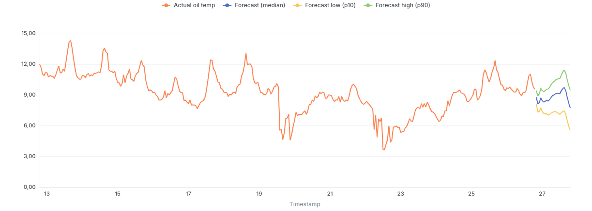
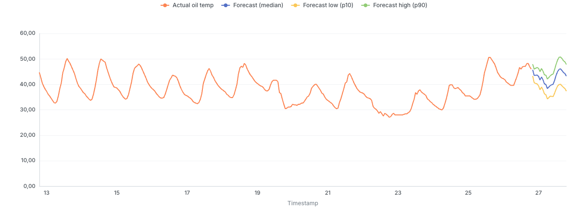

# norn-ett-instance

The **public example instance** of the [norn](https://github.com/tysee/norn)
forecasting platform: a complete, reproducible end-to-end run — raw public data
→ dbt marts → quantile forecasts → lead/lag dependency discovery with an LLM
judge → covariate-boosted re-forecast → rolling-origin calibration → MCP +
Lightdash. Linked into `norn` as a submodule at `instances/ett/`.

The platform itself ships **no domain defaults**; everything domain-specific —
ingestion, marts, job definitions, schedules — lives here. If you want to plug
your own data into norn, this repo is the worked example to read, and
`instances/example/` (in the platform repo) is the blank template to copy.

## The dataset

**ETT — Electricity Transformer Temperature**, from
[ETDataset](https://github.com/zhouhaoyi/ETDataset) (ETT-small), published with
the Informer paper (Zhou et al., *AAAI 2021* best paper). Two years of sensor
readings from two electricity transformer stations in China, widely used as a
time-series forecasting benchmark.

| file    | grain  | rows  | station |
|---------|--------|-------|---------|
| `ETTh1` | hourly | 17420 | 1 |
| `ETTh2` | hourly | 17420 | 2 |
| `ETTm1` | 15-min | 69680 | 1 |
| `ETTm2` | 15-min | 69680 | 2 |

Columns: `date,HUFL,HULL,MUFL,MULL,LUFL,LULL,OT`:

- **`OT` — oil temperature**, the forecast target. Transformer oil temperature
  reacts to electrical load with physical inertia, so it has strong daily
  seasonality *and* genuine upstream drivers — exactly the shape of problem
  norn is built for.
- **`HUFL/HULL/MUFL/MULL/LUFL/LULL`** — six load features (High/Middle/Low
  Useful/Useless Load). These are the candidate **leading indicators**: load
  changes now show up in oil temperature hours later.

Date range `2016-07-01 00:00:00 .. 2018-06-26` (tz-naive, treated as UTC).
Only the hourly `ETTh1`/`ETTh2` are exposed in the marts: norn's grain
contract supports `daily|hourly`, so the 15-min `ETTm*` files are ingested
into `raw_ett` but not unpivoted further.

License note: the upstream repo's `LICENSE` file is **CC BY-ND 4.0**, while
its README states **CC BY 4.0** — a discrepancy in the source worth flagging.

## What is in this repo

| path | purpose |
|---|---|
| `src/norn_ett/` | `ett` CLI: downloads the 4 CSVs from GitHub and inserts them into ClickHouse `raw_ett` (tz-aware UTC, idempotent) |
| `dbt/` | dbt project `norn_ett` (ClickHouse): `mart_metric`, `fct_ot`, `actual_vs_forecast`, `backtest_point`, `calibration`, `feature_leads` |
| `forecasts/` | norn forecast jobs: `ot_baseline.yml`, `ot_timesfm.yml`, `ot_timesfm_xreg.yml` |
| `forecasts/deps/` | 12 dependency jobs: 6 load features × 2 datasets, each asking "does this load feature lead OT?" |
| `deploy/jobs.yml` | manifest for norn's built-in scheduler (cron per job, mounted at `/jobs`) |
| `deploy/crontab.sample` | host-cron alternative to the scheduler service |
| `docs/assets/` | the actual-vs-forecast chart exports shown below |

## Quickstart

```
uv sync
uv run ett backfill           # 4 ETT CSVs -> raw_ett (174 200 rows)
CH_HOST=localhost uv run --with dbt-clickhouse dbt run --project-dir dbt --profiles-dir dbt
```

## The pipeline, step by step

This is the exact sequence that produced the artifacts in this repo (run it
yourself from the norn platform root; the TimesFM steps need the worker:
`docker compose -f docker-compose.services.yml --profile timesfm up -d timesfm`
from norn's `deploy/`, HF weights cached in a named volume, optional
`HF_TOKEN` in `deploy/.env`).

### 1. Ingest

`uv run ett backfill` → `raw_ett` (174 200 rows across the 4 datasets).

### 2. Model the marts (dbt)

`dbt run` builds, among others:

- **`mart_metric`** — the platform's long contract shape
  `(ts, metric_name, value, segment_key)`: every hourly column of
  ETTh1/ETTh2 becomes `metric_name='reading'` with
  `segment_key='dataset=ETTh1|feature=hufl'`, …, `'…|feature=ot'`. One
  generic table, 14 segments, no platform schema changes.
- **`fct_ot`** — a narrow view of the forecast target only (34 840 rows:
  2 datasets × 17 420 hours), consumed by the forecast jobs.

### 3. Baseline forecast

```
uv run norn forecast .../forecasts/ot_baseline.yml
```

`baseline-seasonal-naive`, `grain: hourly`, `seasonality: 24`, `horizon: 24`,
`context_length: 512`. Runs fully in-process (no worker) and writes 24 hourly
points × 2 segments into `forecast_point` with `p10/p50/p90` quantiles. This
is the floor every other model has to beat.

### 4. TimesFM forecast

```
uv run norn forecast .../forecasts/ot_timesfm.yml
```

Same job shape, `model: timesfm-2.5` — inference goes to the standalone
TimesFM HTTP worker (port 9100). If the worker is unreachable the run **fails
explicitly**: a `forecast_run` row with `status=failed` plus a clear error, no
silent fallback to baseline. (The run history in our ClickHouse keeps several
`failed` TimesFM rows from exactly such episodes — by design.)

### 5. Dependency discovery (which loads *lead* the oil temperature?)

```
uv run norn deps .../forecasts/deps/*.yml
```

12 jobs (HUFL/HULL/MUFL/MULL/LUFL/LULL × ETTh1/ETTh2), each testing
`source_segment` (a load feature) against `target_segment` (OT) over
`max_lag: 48` hours with two statistical methods:

- **lagged cross-correlation** — best-correlating shift between the series;
- **Granger causality** — does the load's history improve OT prediction
  beyond OT's own history (p-value, F-statistic).

The numeric evidence lands in `metric_dependency`; then the **LLM judge**
reads both methods' evidence per pair and writes a verdict to
`dependency_explanation`: `is_real`, `confidence`, a plain-text explanation
with caveats.

**This run used local Ollama** — no cloud account or API key involved. The
judge ran `gemma4:e2b` against the local daemon, configured entirely in norn's
`config/agent.yml`:

```yaml
provider: ollama                      # 1 of 5 providers: ollama | openai-api |
model: gemma4:e2b                     #   openai-oauth | openrouter | anthropic-api
base_url: http://localhost:11434/v1   # the local Ollama endpoint
output_mode: native                   # Ollama structured output (JSON schema)
```

To reproduce: install [Ollama](https://ollama.com), `ollama pull gemma4:e2b`,
make sure the daemon listens on `:11434` — that's it, the `ollama` provider
needs no secrets (cloud providers take their key from env instead; see the
platform's configuration guide). Provider and model are instance choices —
the platform ships no default LLM.

Real examples from this run:

| source → OT | method evidence | judge verdict |
|---|---|---|
| `ETTh1\|hufl` | Granger lag 7, p≈0 | **confirmed** (high confidence) |
| `ETTh1\|mufl` | Granger lag 7, p≈0; xcorr lag 4 weaker | **confirmed** (conf ≈ 1.0) |
| `ETTh2\|mufl` | Granger lag 12, p≈2×10⁻⁷ | **confirmed** (conf ≈ 1.0) |
| `ETTh2\|mull` | xcorr 0.334 at lag −23 | **rejected** (conf 0.33: weak, wrong direction) |

If the LLM is unavailable, `deps` degrades gracefully: the numbers are still
written, only the explanation is empty.

### 6. Covariate (XReg) re-forecast — dependencies feed back into the forecast

```
NORN_FORECAST_COVARIATES__HORIZON_POLICY=ffill \
  uv run norn forecast .../forecasts/ot_timesfm_xreg.yml
```

The job sets `use_dependencies: true`: norn auto-attaches every **confirmed**
`source_leads` from `dependency_explanation` as a TimesFM XReg covariate.
`ffill` matters here: confirmed lead lags (7–13 h) are shorter than the 24 h
horizon, so under the `strict` default they would be dropped; `ffill` extends
the leader series instead.

### 7. Calibration — honest quality numbers, not one lucky forecast

```
uv run norn calibrate .../forecasts/<job>.yml
```

Rolling-origin backtest: 8 cutoffs × 24 h horizon = 192 scored points per
segment, written to `forecast_segment`. The `calibration` dbt view lines the
three model families up (these are the actual numbers from this run; target
coverage for the p10–p90 band is 80 %):

| model | segment | coverage % | WAPE % | MAPE % | bias |
|---|---|---|---|---|---|
| baseline-seasonal-naive | ETTh1 | 76.6 | 22.7 | 27.1 | +0.07 |
| timesfm-2.5             | ETTh1 | 80.2 | 13.5 | 17.0 | +0.50 |
| **timesfm-2.5 + xreg**  | ETTh1 | **84.9** | **11.8** | **14.9** | +0.51 |
| baseline-seasonal-naive | ETTh2 | 67.2 | 13.9 | 14.6 | −0.39 |
| timesfm-2.5             | ETTh2 | 72.9 | **7.7** | **8.1** | −0.11 |
| **timesfm-2.5 + xreg**  | ETTh2 | **76.0** | 8.7 | 8.9 | −0.53 |

Reading it: TimesFM roughly **halves the baseline's WAPE** on both stations;
the confirmed load covariates then buy ETTh1 another ~1.7 WAPE points and
+4.7 points of interval coverage. On ETTh2 xreg improves coverage but
slightly trades off WAPE — calibration exists precisely to make that visible
before you trust a model.

### 8. Serve it

- **MCP (agents):** `get_forecast(metric="ot", segment="dataset=ETTh1|feature=ot")`
  returns the forecast rows; `get_dependencies` returns the numbers *and* the
  judge's explanation; `get_calibration` returns the table above.
- **Lightdash (humans):** the `actual_vs_forecast` view drives the dashboard —
  two weeks of actual oil temperature, then the forecast median with the
  p10–p90 band (the actual line ends at the forecast boundary):





## Scheduling

`deploy/jobs.yml` is the manifest for norn's built-in scheduler (the
`schedule:` hints inside job YAMLs are ignored; the manifest is the source of
truth). Mount the instance root at `/jobs`:

```
NORN_JOBS_DIR=../instances/ett docker compose -f docker-compose.services.yml \
  --profile scheduler up -d scheduler
```

ETT is a static historical dataset, so the schedules are illustrative — the
same wiring against live data gives you a self-updating forecast pipeline.
`deploy/crontab.sample` is the host-cron equivalent.

## Notes

- TimesFM jobs **fail explicitly** when the worker is down (`forecast_run`
  row with `status=failed`); run `ot_baseline.yml` if you want a forecast
  without the worker.
- Tests build into an isolated DB (`CH_SCHEMA=norn_ett_test`) — never into
  the live `norn_ett` (see `dbt/profiles.yml` and `tests/`).
